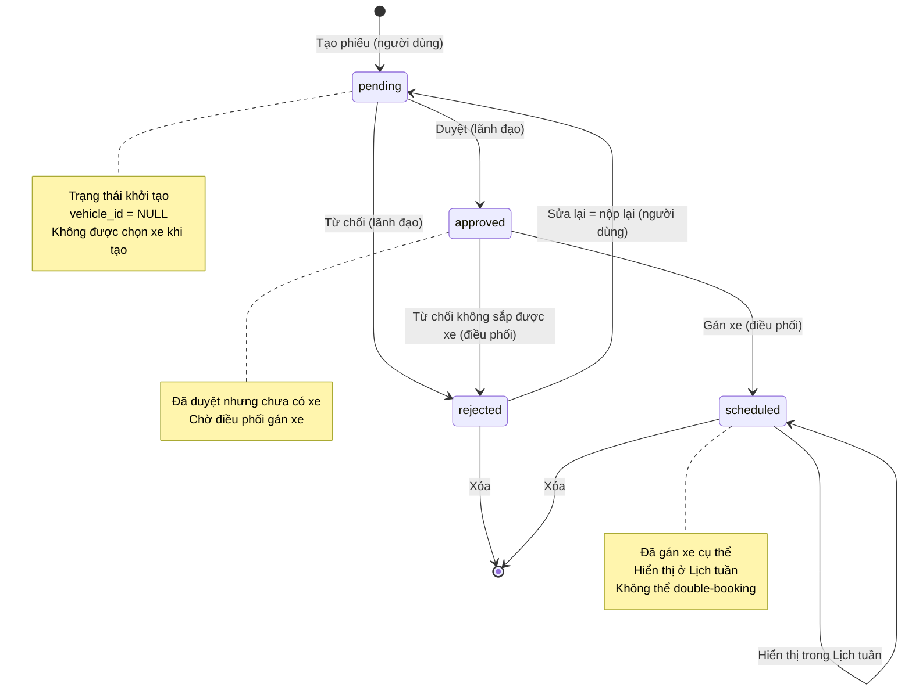
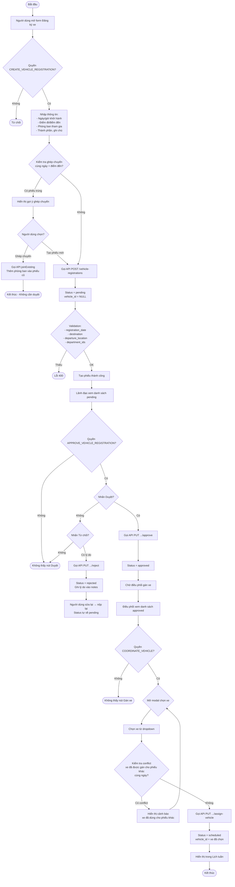
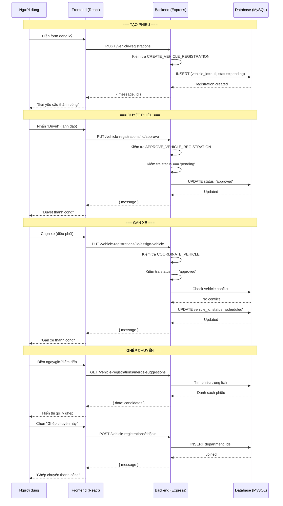
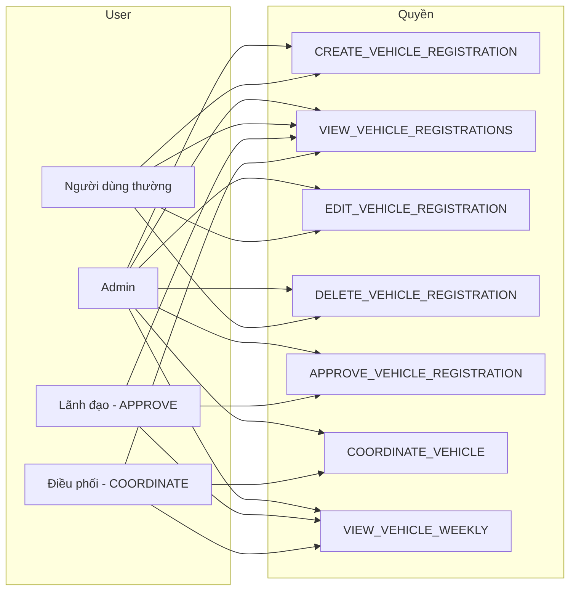
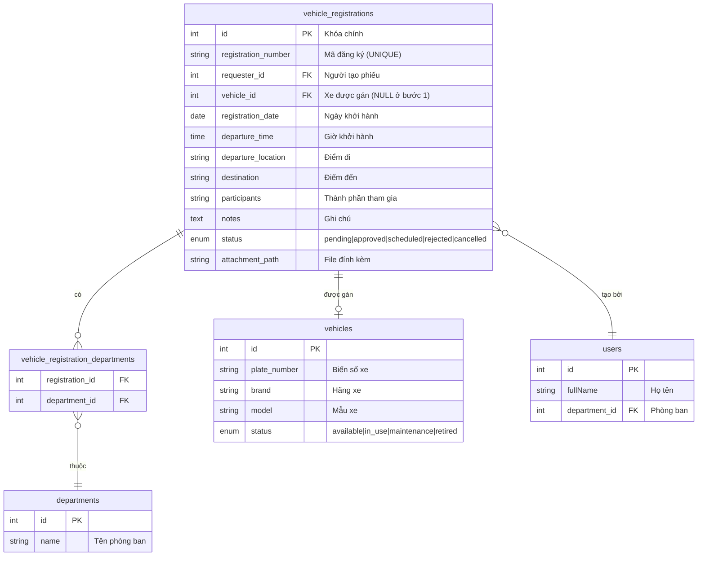

# Sơ đồ luồng xử lý Đăng ký xe (Vehicle Registration)

## 1. Sơ đồ trạng thái (State Machine)

## 2. Sơ đồ quy trình xử lý (Activity Diagram)

## 3. Sơ đồ kiến trúc API

## 4. Sơ đồ phân quyền (Permission Matrix)

## 5. Sơ đồ cấu trúc Database (ERD)

## 6. Ghi chú logic quan trọng

### Ràng buộc khi tạo phiếu:
- `vehicle_id` phải là `NULL` - không được chọn xe khi tạo
- `status` luôn bắt đầu là `pending`
- Bắt buộc có: `registration_date`, `destination`, `departure_location`, `department_ids`

### Ràng buộc khi sửa phiếu:
- Chỉ sửa được khi `pending` hoặc `rejected`
- Sửa khi `rejected` = nộp lại → tự chuyển về `pending`
- Không cho sửa `vehicle_id` hay `status` qua API sửa thông thường

### Ràng buộc khi duyệt (approve):
- Chỉ duyệt được khi `status === 'pending'`

### Ràng buộc khi gán xe (assignVehicle):
- Chỉ gán xe được khi `status === 'approved'`
- Kiểm tra double-booking: xe không được gán cho phiếu khác cùng ngày

### Ràng buộc khi từ chối (reject):
- Cho phép ở cả `pending` (lãnh đạo từ chối) và `approved` (điều phối từ chối)

### Ghép chuyến (Merge/Carpool):
- Chỉ ghép vào phiếu đã `approved` hoặc `scheduled`
- Dùng `INSERT IGNORE` để tránh trùng phòng ban

